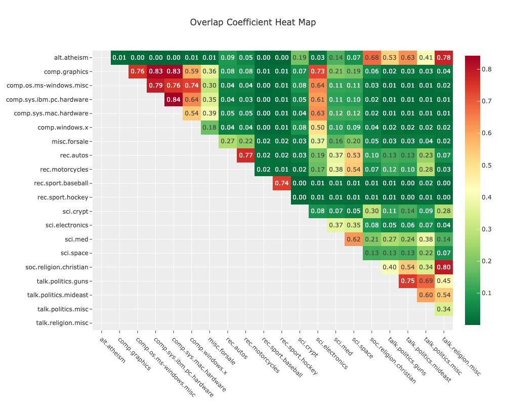
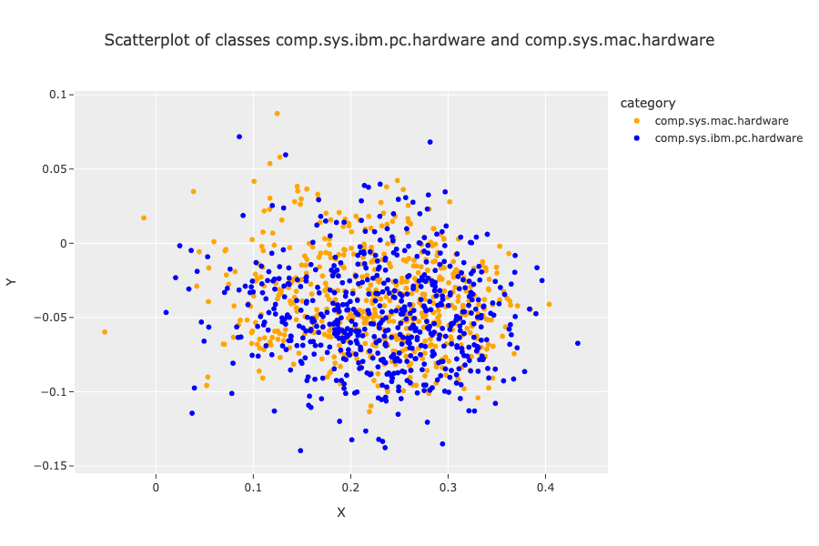
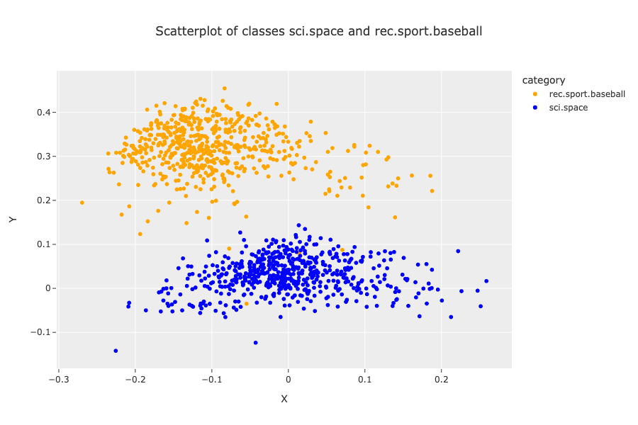

# Calculate Class Overlap
The purpose of this project is to develop a tool that can examine the extent to which the embeddings of any two classes of labeled documents overlap. I will explore visualizations of these embeddings but my ultimate goal is to have a metric that can provide a quick summary of the comparison of all classes and guide further investigation. The main use case I have for this is when conducting quality assurance / quality control of the labeling of documents. With the overlap metric and a summary graphic, an individual or team could quickly determine which categories they may need to examine more closely. In particular, I intend this to be a decision tool: human labeling and review is often the most time-intensive step in creating structured date, and this will help people decide where in their data they have the greatest need to commit the time to (re-)read the source documents of overlapping categories and determine whether or not the existing labels make sense or need to change.

I calculate a kernel density estimate for each class and for each pair of classes calculate an overlap metric. The goal is to generate a heat map that quickly guides the viewer to the classes with the most overlap.

My data source for this project was the Usenet News20 data set, available here:
http://qwone.com/~jason/20Newsgroups/20news-bydate.tar.gz

The data set contains different categories of news articles and serves as a good test case for my purposes. I downloaded the raw data manually and stored it in the `data/raw/` folder. My data processing steps are in the `data_prep.ipynb` notebook, and the preprocessed data objects are in the `data/processed/` folder. 

Here is an example of the overlap matrix:

The scatterplots below show examples of comparing the distribution of embeddings of two topics we would consider similar and two we would consider to be different.

As expected, when we look at two similar topics we see a significant amount of overlap between the two topics' embeddings.

When we look at two topics we would think of as dissimilar, we see minimal overlap in the two embedding distributions.

The final output of this project is a Plotly dashboard that shows both the overlap matrix and an interactive scatterplot that can display any two classes of data from the data set. Run the script `src/embedding_dashboard.py` from the command line and then navigate a browser to the URL it supplies.
